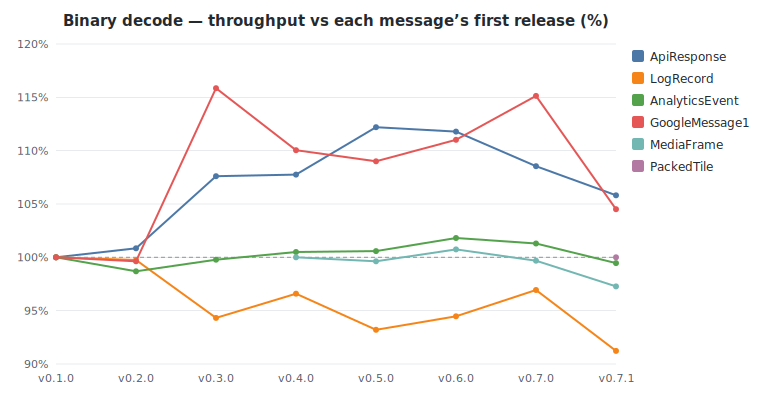
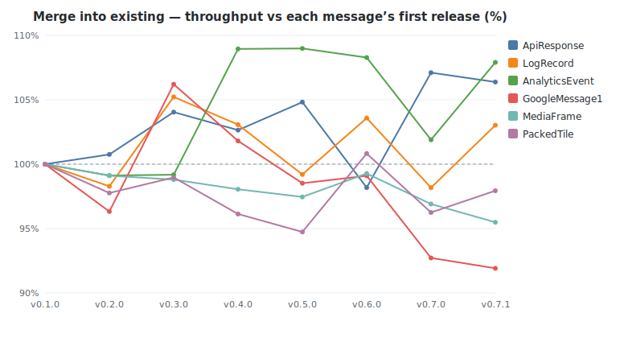
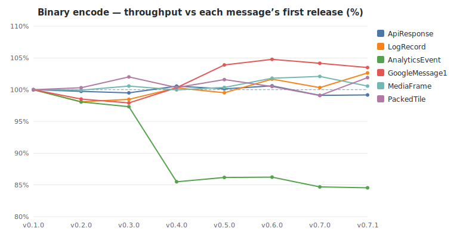
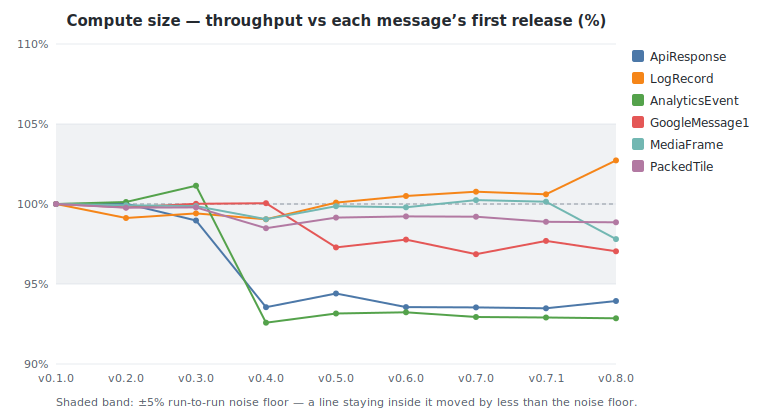
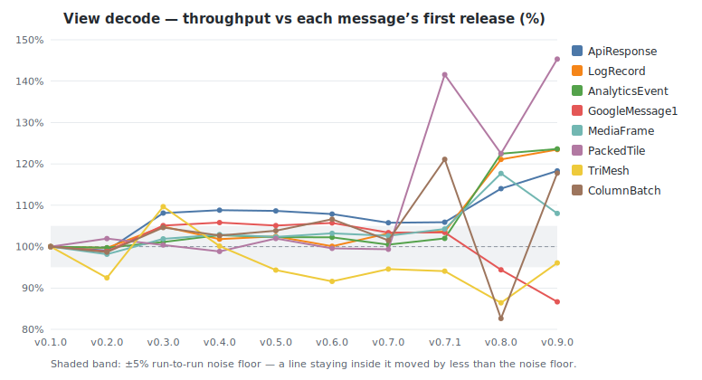
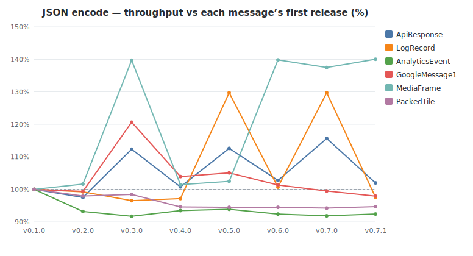
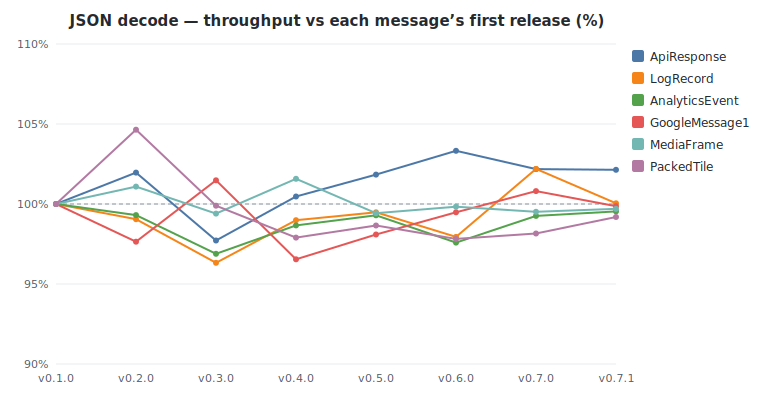

# buffa benchmark history

Throughput of buffa's own protobuf benchmarks across releases, measured on a
dedicated bare-metal box (turbo off, `performance` governor, per-core pinned).
Each release's source is built at one fixed toolchain and profile, held
constant across the series, so a delta reflects buffa's code rather than a
compiler or build-config change. The headline metric is **throughput in
MiB/s**, the median across cores, comparable across releases even when a tag's
dataset changed size. See [README.md](README.md) for methodology and caveats.

<!-- GENERATED by benchmarks/history/generate.py — do not edit by hand. -->

- Releases: v0.1.0, v0.2.0, v0.3.0, v0.4.0, v0.5.0, v0.6.0, v0.7.0, v0.7.1
- Machine: c7i.metal-24xl — Intel(R) Xeon(R) Platinum 8488C
- Tuning: turbo_disabled=1, governor=performance, pin_core=distinct-physical-per-instance
- Build profile: lto=true, codegen-units=1, per-message-isolated (dense)
- Samples: median of 4 cores per release (per-benchmark spread in run files)
- Criterion: 0.5.1 · latest measured at 2026-06-19T23:47:11Z

## Biggest movers (first tracked release → latest)

| Benchmark | First | Latest | Change | Range |
|-----------|------:|-------:|-------:|-------|
| PackedTile / decode_view | 176 | 249 | +42% | v0.1.0→v0.7.1 |
| MediaFrame / json_encode | 701 | 982 | +40% | v0.1.0→v0.7.1 |
| ApiResponse / decode_view | 954 | 1,054 | +10% | v0.1.0→v0.7.1 |
| AnalyticsEvent / merge | 143 | 154 | +8% | v0.1.0→v0.7.1 |
| ApiResponse / merge | 735 | 782 | +6% | v0.1.0→v0.7.1 |
| LogRecord / decode_view | 1,306 | 1,369 | +5% | v0.1.0→v0.7.1 |
| GoogleMessage1 / encode | 2,042 | 2,113 | +3% | v0.1.0→v0.7.1 |
| LogRecord / decode | 467 | 482 | +3% | v0.1.0→v0.7.1 |
| AnalyticsEvent / encode | 468 | 396 | −15% | v0.1.0→v0.7.1 |
| AnalyticsEvent / compute_size | 1,398 | 1,251 | −11% | v0.1.0→v0.7.1 |
| GoogleMessage1 / merge | 808 | 742 | −8% | v0.1.0→v0.7.1 |
| AnalyticsEvent / json_encode | 530 | 490 | −8% | v0.1.0→v0.7.1 |
| ApiResponse / compute_size | 7,994 | 7,532 | −6% | v0.1.0→v0.7.1 |
| PackedTile / decode | 226 | 214 | −5% | v0.1.0→v0.7.1 |
| PackedTile / json_encode | 385 | 364 | −5% | v0.1.0→v0.7.1 |
| MediaFrame / merge | 15,563 | 14,861 | −5% | v0.1.0→v0.7.1 |

All throughput values are MiB/s; higher is better.

## Throughput by operation (MiB/s)

### Binary decode

| Message | v0.1.0 | v0.2.0 | v0.3.0 | v0.4.0 | v0.5.0 | v0.6.0 | v0.7.0 | v0.7.1 |
|---------|------:|------:|------:|------:|------:|------:|------:|------:|
| ApiResponse | 578 | 568 (−2%) | 560 (−1%) | 564 (+1%) | 590 (+5%) | 558 (−5%) | 570 (+2%) | 585 (+3%) |
| LogRecord | 467 | 463 (−1%) | 502 (+8%) | 496 (−1%) | 484 (−2%) | 502 (+4%) | 484 (−4%) | 482 (−0%) |
| AnalyticsEvent | 125 | 125 (+0%) | 125 (+0%) | 127 (+1%) | 126 (−1%) | 125 (−0%) | 127 (+1%) | 127 (−0%) |
| GoogleMessage1 | 546 | 534 (−2%) | 580 (+9%) | 558 (−4%) | 571 (+2%) | 572 (+0%) | 527 (−8%) | 557 (+6%) |
| MediaFrame | 11,979 | 11,658 (−3%) | 11,787 (+1%) | 11,863 (+1%) | 11,880 (+0%) | 11,976 (+1%) | 11,755 (−2%) | 11,723 (−0%) |
| PackedTile | 226 | 225 (−0%) | 224 (−0%) | 216 (−4%) | 215 (−0%) | 224 (+4%) | 214 (−4%) | 214 (−0%) |

### Merge into existing

| Message | v0.1.0 | v0.2.0 | v0.3.0 | v0.4.0 | v0.5.0 | v0.6.0 | v0.7.0 | v0.7.1 |
|---------|------:|------:|------:|------:|------:|------:|------:|------:|
| ApiResponse | 735 | 741 (+1%) | 765 (+3%) | 754 (−1%) | 770 (+2%) | 722 (−6%) | 787 (+9%) | 782 (−1%) |
| LogRecord | 699 | 687 (−2%) | 736 (+7%) | 721 (−2%) | 694 (−4%) | 724 (+4%) | 687 (−5%) | 720 (+5%) |
| AnalyticsEvent | 143 | 142 (−1%) | 142 (+0%) | 156 (+10%) | 156 (+0%) | 155 (−1%) | 145 (−6%) | 154 (+6%) |
| GoogleMessage1 | 808 | 778 (−4%) | 858 (+10%) | 822 (−4%) | 796 (−3%) | 801 (+1%) | 749 (−6%) | 742 (−1%) |
| MediaFrame | 15,563 | 15,424 (−1%) | 15,377 (−0%) | 15,260 (−1%) | 15,167 (−1%) | 15,451 (+2%) | 15,081 (−2%) | 14,861 (−1%) |
| PackedTile | 259 | 253 (−2%) | 256 (+1%) | 249 (−3%) | 245 (−1%) | 261 (+6%) | 249 (−5%) | 254 (+2%) |

### Binary encode

| Message | v0.1.0 | v0.2.0 | v0.3.0 | v0.4.0 | v0.5.0 | v0.6.0 | v0.7.0 | v0.7.1 |
|---------|------:|------:|------:|------:|------:|------:|------:|------:|
| ApiResponse | 1,962 | 1,957 (−0%) | 1,952 (−0%) | 1,973 (+1%) | 1,964 (−0%) | 1,974 (+0%) | 1,944 (−1%) | 1,946 (+0%) |
| LogRecord | 3,062 | 3,004 (−2%) | 3,016 (+0%) | 3,071 (+2%) | 3,048 (−1%) | 3,113 (+2%) | 3,072 (−1%) | 3,143 (+2%) |
| AnalyticsEvent | 468 | 459 (−2%) | 456 (−1%) | 401 (−12%) | 404 (+1%) | 404 (+0%) | 397 (−2%) | 396 (−0%) |
| GoogleMessage1 | 2,042 | 2,012 (−1%) | 1,999 (−1%) | 2,048 (+2%) | 2,121 (+4%) | 2,139 (+1%) | 2,127 (−1%) | 2,113 (−1%) |
| MediaFrame | 25,280 | 25,263 (−0%) | 25,424 (+1%) | 25,272 (−1%) | 25,370 (+0%) | 25,736 (+1%) | 25,807 (+0%) | 25,424 (−1%) |
| PackedTile | 473 | 475 (+0%) | 483 (+2%) | 475 (−2%) | 481 (+1%) | 476 (−1%) | 469 (−1%) | 482 (+3%) |

### Compute size

| Message | v0.1.0 | v0.2.0 | v0.3.0 | v0.4.0 | v0.5.0 | v0.6.0 | v0.7.0 | v0.7.1 |
|---------|------:|------:|------:|------:|------:|------:|------:|------:|
| ApiResponse | 7,994 | 7,994 (+0%) | 7,943 (−1%) | 7,495 (−6%) | 7,609 (+2%) | 7,502 (−1%) | 7,529 (+0%) | 7,532 (+0%) |
| LogRecord | 9,372 | 9,375 (+0%) | 9,345 (−0%) | 9,272 (−1%) | 9,443 (+2%) | 9,407 (−0%) | 9,503 (+1%) | 9,472 (−0%) |
| AnalyticsEvent | 1,398 | 1,390 (−1%) | 1,364 (−2%) | 1,276 (−6%) | 1,257 (−1%) | 1,224 (−3%) | 1,262 (+3%) | 1,251 (−1%) |
| GoogleMessage1 | 4,803 | 4,788 (−0%) | 4,805 (+0%) | 4,786 (−0%) | 4,713 (−2%) | 4,658 (−1%) | 4,673 (+0%) | 4,653 (−0%) |
| MediaFrame | 263,511 | 262,738 (−0%) | 263,286 (+0%) | 259,482 (−1%) | 259,333 (−0%) | 260,746 (+1%) | 260,214 (−0%) | 258,719 (−1%) |
| PackedTile | 1,480 | 1,492 (+1%) | 1,483 (−1%) | 1,466 (−1%) | 1,464 (−0%) | 1,476 (+1%) | 1,478 (+0%) | 1,467 (−1%) |

### View decode

| Message | v0.1.0 | v0.2.0 | v0.3.0 | v0.4.0 | v0.5.0 | v0.6.0 | v0.7.0 | v0.7.1 |
|---------|------:|------:|------:|------:|------:|------:|------:|------:|
| ApiResponse | 954 | 944 (−1%) | 1,025 (+9%) | 1,024 (−0%) | 1,114 (+9%) | 949 (−15%) | 1,094 (+15%) | 1,054 (−4%) |
| LogRecord | 1,306 | 1,296 (−1%) | 1,360 (+5%) | 1,203 (−12%) | 1,233 (+3%) | 1,240 (+0%) | 1,208 (−3%) | 1,369 (+13%) |
| AnalyticsEvent | 196 | 196 (+0%) | 198 (+1%) | 200 (+1%) | 201 (+0%) | 200 (−0%) | 204 (+2%) | 201 (−1%) |
| GoogleMessage1 | 824 | 774 (−6%) | 819 (+6%) | 841 (+3%) | 840 (−0%) | 863 (+3%) | 797 (−8%) | 797 (+0%) |
| MediaFrame | 44,005 | 44,889 (+2%) | 48,285 (+8%) | 44,686 (−7%) | 48,160 (+8%) | 46,686 (−3%) | 46,172 (−1%) | 43,347 (−6%) |
| PackedTile | 176 | 169 (−4%) | 172 (+1%) | 174 (+1%) | 169 (−3%) | 169 (+0%) | 169 (+0%) | 249 (+47%) |

### JSON encode

| Message | v0.1.0 | v0.2.0 | v0.3.0 | v0.4.0 | v0.5.0 | v0.6.0 | v0.7.0 | v0.7.1 |
|---------|------:|------:|------:|------:|------:|------:|------:|------:|
| ApiResponse | 502 | 490 (−2%) | 565 (+15%) | 506 (−10%) | 566 (+12%) | 516 (−9%) | 581 (+13%) | 512 (−12%) |
| LogRecord | 677 | 672 (−1%) | 654 (−3%) | 658 (+1%) | 879 (+33%) | 682 (−22%) | 879 (+29%) | 661 (−25%) |
| AnalyticsEvent | 530 | 494 (−7%) | 486 (−2%) | 496 (+2%) | 498 (+0%) | 490 (−2%) | 487 (−1%) | 490 (+1%) |
| GoogleMessage1 | 530 | 527 (−1%) | 640 (+21%) | 551 (−14%) | 557 (+1%) | 537 (−4%) | 527 (−2%) | 519 (−2%) |
| MediaFrame | 701 | 713 (+2%) | 980 (+37%) | 711 (−27%) | 718 (+1%) | 980 (+36%) | 964 (−2%) | 982 (+2%) |
| PackedTile | 385 | 377 (−2%) | 379 (+0%) | 364 (−4%) | 364 (−0%) | 364 (+0%) | 363 (−0%) | 364 (+0%) |

### JSON decode

| Message | v0.1.0 | v0.2.0 | v0.3.0 | v0.4.0 | v0.5.0 | v0.6.0 | v0.7.0 | v0.7.1 |
|---------|------:|------:|------:|------:|------:|------:|------:|------:|
| ApiResponse | 459 | 468 (+2%) | 448 (−4%) | 461 (+3%) | 467 (+1%) | 474 (+1%) | 469 (−1%) | 469 (−0%) |
| LogRecord | 466 | 462 (−1%) | 449 (−3%) | 461 (+3%) | 463 (+0%) | 456 (−2%) | 476 (+4%) | 466 (−2%) |
| AnalyticsEvent | 177 | 175 (−1%) | 171 (−2%) | 174 (+2%) | 175 (+1%) | 172 (−2%) | 175 (+2%) | 176 (+0%) |
| GoogleMessage1 | 402 | 392 (−2%) | 408 (+4%) | 388 (−5%) | 394 (+2%) | 400 (+1%) | 405 (+1%) | 401 (−1%) |
| MediaFrame | 1,222 | 1,236 (+1%) | 1,215 (−2%) | 1,242 (+2%) | 1,215 (−2%) | 1,220 (+0%) | 1,216 (−0%) | 1,219 (+0%) |
| PackedTile | 193 | 202 (+5%) | 193 (−5%) | 189 (−2%) | 191 (+1%) | 189 (−1%) | 190 (+0%) | 192 (+1%) |

