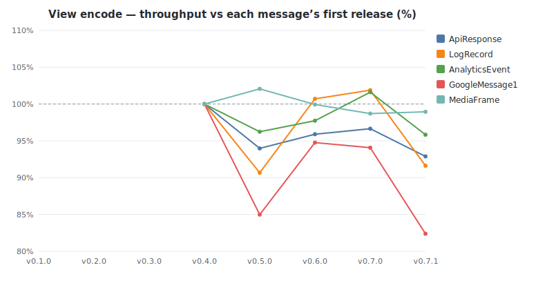
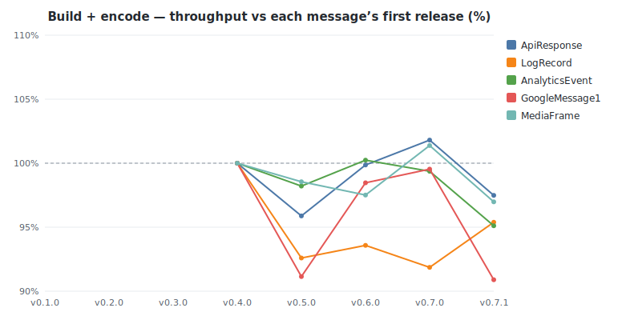
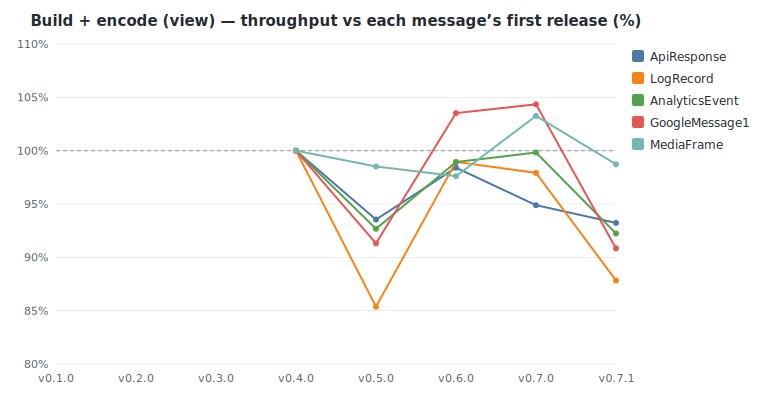

# buffa benchmark history

Throughput of buffa's own protobuf benchmarks, measured once per release on
a dedicated bare-metal box (turbo off, `performance` governor, core-pinned).
Each release was built from its own tag and run as it shipped, so the numbers
are what that release actually delivered. The headline metric is **throughput
in MiB/s**, which stays comparable across releases even when a tag's benchmark
dataset changed size. See [README.md](README.md) for methodology and caveats.

<!-- GENERATED by benchmarks/history/generate.py — do not edit by hand. -->

- Releases: v0.1.0, v0.2.0, v0.3.0, v0.4.0, v0.5.0, v0.6.0, v0.7.0, v0.7.1
- Machine: c7i.metal-24xl — Intel(R) Xeon(R) Platinum 8488C
- Tuning: turbo_disabled=1, governor=performance, pin_core=4
- Criterion: 0.5.1 · latest measured at 2026-06-19T04:09:33Z

## Biggest movers (first tracked release → latest)

| Benchmark | First | Latest | Change | Range |
|-----------|------:|-------:|-------:|-------|
| MediaFrame / json_encode | 678 | 889 | +31% | v0.4.0→v0.7.1 |
| LogRecord / json_encode | 633 | 802 | +27% | v0.1.0→v0.7.1 |
| GoogleMessage1 / json_encode | 503 | 577 | +15% | v0.1.0→v0.7.1 |
| ApiResponse / json_encode | 472 | 523 | +11% | v0.1.0→v0.7.1 |
| AnalyticsEvent / json_encode | 453 | 497 | +10% | v0.1.0→v0.7.1 |
| GoogleMessage1 / compute_size | 4,113 | 4,415 | +7% | v0.1.0→v0.7.1 |
| ApiResponse / merge | 606 | 643 | +6% | v0.1.0→v0.7.1 |
| ApiResponse / decode | 471 | 498 | +6% | v0.1.0→v0.7.1 |
| GoogleMessage1 / encode_view | 1,639 | 1,350 | −18% | v0.4.0→v0.7.1 |
| LogRecord / build_encode_view | 1,752 | 1,539 | −12% | v0.4.0→v0.7.1 |
| GoogleMessage1 / build_encode_view | 723 | 657 | −9% | v0.4.0→v0.7.1 |
| GoogleMessage1 / build_encode | 519 | 472 | −9% | v0.4.0→v0.7.1 |
| LogRecord / decode | 446 | 407 | −9% | v0.1.0→v0.7.1 |
| AnalyticsEvent / compute_size | 1,231 | 1,125 | −9% | v0.1.0→v0.7.1 |
| LogRecord / encode_view | 2,836 | 2,599 | −8% | v0.4.0→v0.7.1 |
| LogRecord / merge | 666 | 613 | −8% | v0.1.0→v0.7.1 |

All throughput values are MiB/s; higher is better.

## Throughput by operation (MiB/s)

### Binary decode

| Message | v0.1.0 | v0.2.0 | v0.3.0 | v0.4.0 | v0.5.0 | v0.6.0 | v0.7.0 | v0.7.1 |
|---------|------:|------:|------:|------:|------:|------:|------:|------:|
| ApiResponse | 471 | 475 (+1%) | 507 (+7%) | 508 (+0%) | 529 (+4%) | 527 (−0%) | 511 (−3%) | 498 (−3%) |
| LogRecord | 446 | 445 (−0%) | 421 (−5%) | 431 (+2%) | 416 (−4%) | 422 (+1%) | 433 (+3%) | 407 (−6%) |
| AnalyticsEvent | 121 | 119 (−1%) | 121 (+1%) | 122 (+1%) | 122 (+0%) | 123 (+1%) | 123 (−1%) | 120 (−2%) |
| GoogleMessage1 | 543 | 541 (−0%) | 629 (+16%) | 597 (−5%) | 591 (−1%) | 602 (+2%) | 625 (+4%) | 567 (−9%) |
| MediaFrame | — | — | — | 9,859 | 9,823 (−0%) | 9,932 (+1%) | 9,828 (−1%) | 9,591 (−2%) |
| PackedTile | — | — | — | — | — | — | — | 230 |

### Merge into existing

| Message | v0.1.0 | v0.2.0 | v0.3.0 | v0.4.0 | v0.5.0 | v0.6.0 | v0.7.0 | v0.7.1 |
|---------|------:|------:|------:|------:|------:|------:|------:|------:|
| ApiResponse | 606 | 607 (+0%) | 639 (+5%) | 646 (+1%) | 657 (+2%) | 666 (+1%) | 642 (−4%) | 643 (+0%) |
| LogRecord | 666 | 664 (−0%) | 640 (−4%) | 654 (+2%) | 634 (−3%) | 637 (+0%) | 662 (+4%) | 613 (−7%) |
| AnalyticsEvent | 145 | 144 (−0%) | 148 (+3%) | 149 (+1%) | 148 (−1%) | 144 (−3%) | 147 (+2%) | 145 (−2%) |
| GoogleMessage1 | 703 | 704 (+0%) | 818 (+16%) | 820 (+0%) | 788 (−4%) | 822 (+4%) | 821 (−0%) | 724 (−12%) |
| MediaFrame | — | — | — | 13,957 | 13,906 (−0%) | 13,935 (+0%) | 13,688 (−2%) | 13,087 (−4%) |
| PackedTile | — | — | — | — | — | — | — | 288 |

### Binary encode

| Message | v0.1.0 | v0.2.0 | v0.3.0 | v0.4.0 | v0.5.0 | v0.6.0 | v0.7.0 | v0.7.1 |
|---------|------:|------:|------:|------:|------:|------:|------:|------:|
| ApiResponse | 1,388 | 1,388 (+0%) | 1,591 (+15%) | 1,574 (−1%) | 1,375 (−13%) | 1,535 (+12%) | 1,538 (+0%) | 1,415 (−8%) |
| LogRecord | 2,332 | 2,313 (−1%) | 2,594 (+12%) | 2,532 (−2%) | 2,300 (−9%) | 2,573 (+12%) | 2,565 (−0%) | 2,291 (−11%) |
| AnalyticsEvent | 387 | 386 (−0%) | 402 (+4%) | 364 (−10%) | 352 (−3%) | 351 (−0%) | 363 (+3%) | 360 (−1%) |
| GoogleMessage1 | 1,384 | 1,380 (−0%) | 1,486 (+8%) | 1,617 (+9%) | 1,405 (−13%) | 1,582 (+13%) | 1,508 (−5%) | 1,388 (−8%) |
| MediaFrame | — | — | — | 24,465 | 25,668 (+5%) | 24,678 (−4%) | 24,376 (−1%) | 24,833 (+2%) |
| PackedTile | — | — | — | — | — | — | — | 441 |

### Compute size

| Message | v0.1.0 | v0.2.0 | v0.3.0 | v0.4.0 | v0.5.0 | v0.6.0 | v0.7.0 | v0.7.1 |
|---------|------:|------:|------:|------:|------:|------:|------:|------:|
| ApiResponse | 7,852 | 7,853 (+0%) | 7,978 (+2%) | 7,499 (−6%) | 7,543 (+1%) | 7,504 (−1%) | 7,539 (+0%) | 7,523 (−0%) |
| LogRecord | 9,160 | 9,191 (+0%) | 9,095 (−1%) | 9,120 (+0%) | 9,363 (+3%) | 9,477 (+1%) | 9,370 (−1%) | 9,342 (−0%) |
| AnalyticsEvent | 1,231 | 1,196 (−3%) | 1,211 (+1%) | 1,117 (−8%) | 1,102 (−1%) | 1,109 (+1%) | 1,100 (−1%) | 1,125 (+2%) |
| GoogleMessage1 | 4,113 | 4,101 (−0%) | 4,150 (+1%) | 4,101 (−1%) | 4,449 (+8%) | 4,438 (−0%) | 4,430 (−0%) | 4,415 (−0%) |
| MediaFrame | — | — | — | 258,898 | 259,359 (+0%) | 260,024 (+0%) | 260,035 (+0%) | 258,959 (−0%) |
| PackedTile | — | — | — | — | — | — | — | 1,441 |

### View decode

| Message | v0.1.0 | v0.2.0 | v0.3.0 | v0.4.0 | v0.5.0 | v0.6.0 | v0.7.0 | v0.7.1 |
|---------|------:|------:|------:|------:|------:|------:|------:|------:|
| ApiResponse | 830 | 837 (+1%) | 869 (+4%) | 841 (−3%) | 853 (+1%) | 951 (+11%) | 891 (−6%) | 862 (−3%) |
| LogRecord | 1,128 | 1,120 (−1%) | 1,238 (+10%) | 1,237 (−0%) | 1,184 (−4%) | 1,264 (+7%) | 1,220 (−4%) | 1,114 (−9%) |
| AnalyticsEvent | 192 | 193 (+0%) | 193 (+0%) | 186 (−4%) | 188 (+1%) | 190 (+1%) | 187 (−1%) | 185 (−1%) |
| GoogleMessage1 | 772 | 774 (+0%) | 798 (+3%) | 808 (+1%) | 755 (−7%) | 874 (+16%) | 868 (−1%) | 711 (−18%) |
| MediaFrame | — | — | — | 41,219 | 42,972 (+4%) | 44,050 (+3%) | 43,694 (−1%) | 42,588 (−3%) |
| PackedTile | — | — | — | — | — | — | — | 235 |

### View encode

| Message | v0.1.0 | v0.2.0 | v0.3.0 | v0.4.0 | v0.5.0 | v0.6.0 | v0.7.0 | v0.7.1 |
|---------|------:|------:|------:|------:|------:|------:|------:|------:|
| ApiResponse | — | — | — | 1,589 | 1,493 (−6%) | 1,524 (+2%) | 1,536 (+1%) | 1,476 (−4%) |
| LogRecord | — | — | — | 2,836 | 2,572 (−9%) | 2,857 (+11%) | 2,890 (+1%) | 2,599 (−10%) |
| AnalyticsEvent | — | — | — | 373 | 359 (−4%) | 364 (+2%) | 379 (+4%) | 357 (−6%) |
| GoogleMessage1 | — | — | — | 1,639 | 1,393 (−15%) | 1,553 (+12%) | 1,542 (−1%) | 1,350 (−12%) |
| MediaFrame | — | — | — | 26,149 | 26,689 (+2%) | 26,131 (−2%) | 25,810 (−1%) | 25,874 (+0%) |

### Build + encode

| Message | v0.1.0 | v0.2.0 | v0.3.0 | v0.4.0 | v0.5.0 | v0.6.0 | v0.7.0 | v0.7.1 |
|---------|------:|------:|------:|------:|------:|------:|------:|------:|
| ApiResponse | — | — | — | 443 | 424 (−4%) | 442 (+4%) | 451 (+2%) | 432 (−4%) |
| LogRecord | — | — | — | 309 | 286 (−7%) | 289 (+1%) | 284 (−2%) | 295 (+4%) |
| AnalyticsEvent | — | — | — | 230 | 226 (−2%) | 230 (+2%) | 228 (−1%) | 219 (−4%) |
| GoogleMessage1 | — | — | — | 519 | 473 (−9%) | 511 (+8%) | 516 (+1%) | 472 (−9%) |
| MediaFrame | — | — | — | 12,853 | 12,667 (−1%) | 12,534 (−1%) | 13,030 (+4%) | 12,465 (−4%) |

### Build + encode (view)

| Message | v0.1.0 | v0.2.0 | v0.3.0 | v0.4.0 | v0.5.0 | v0.6.0 | v0.7.0 | v0.7.1 |
|---------|------:|------:|------:|------:|------:|------:|------:|------:|
| ApiResponse | — | — | — | 1,034 | 967 (−6%) | 1,017 (+5%) | 981 (−4%) | 964 (−2%) |
| LogRecord | — | — | — | 1,752 | 1,496 (−15%) | 1,733 (+16%) | 1,715 (−1%) | 1,539 (−10%) |
| AnalyticsEvent | — | — | — | 698 | 647 (−7%) | 691 (+7%) | 697 (+1%) | 644 (−8%) |
| GoogleMessage1 | — | — | — | 723 | 661 (−9%) | 749 (+13%) | 755 (+1%) | 657 (−13%) |
| MediaFrame | — | — | — | 30,960 | 30,500 (−1%) | 30,217 (−1%) | 31,968 (+6%) | 30,563 (−4%) |

### JSON encode

| Message | v0.1.0 | v0.2.0 | v0.3.0 | v0.4.0 | v0.5.0 | v0.6.0 | v0.7.0 | v0.7.1 |
|---------|------:|------:|------:|------:|------:|------:|------:|------:|
| ApiResponse | 472 | 491 (+4%) | 466 (−5%) | 493 (+6%) | 530 (+8%) | 525 (−1%) | 548 (+4%) | 523 (−5%) |
| LogRecord | 633 | 633 (−0%) | 619 (−2%) | 640 (+3%) | 807 (+26%) | 826 (+2%) | 834 (+1%) | 802 (−4%) |
| AnalyticsEvent | 453 | 463 (+2%) | 444 (−4%) | 449 (+1%) | 492 (+10%) | 483 (−2%) | 493 (+2%) | 497 (+1%) |
| GoogleMessage1 | 503 | 503 (+0%) | 503 (+0%) | 531 (+5%) | 621 (+17%) | 576 (−7%) | 620 (+8%) | 577 (−7%) |
| MediaFrame | — | — | — | 678 | 903 (+33%) | 892 (−1%) | 910 (+2%) | 889 (−2%) |

### JSON decode

| Message | v0.1.0 | v0.2.0 | v0.3.0 | v0.4.0 | v0.5.0 | v0.6.0 | v0.7.0 | v0.7.1 |
|---------|------:|------:|------:|------:|------:|------:|------:|------:|
| ApiResponse | 407 | 412 (+1%) | 422 (+3%) | 411 (−3%) | 404 (−2%) | 413 (+2%) | 417 (+1%) | 419 (+1%) |
| LogRecord | 428 | 429 (+0%) | 438 (+2%) | 421 (−4%) | 422 (+0%) | 422 (−0%) | 429 (+2%) | 412 (−4%) |
| AnalyticsEvent | 157 | 157 (−0%) | 156 (−1%) | 157 (+1%) | 157 (+0%) | 155 (−2%) | 155 (+0%) | 156 (+1%) |
| GoogleMessage1 | 366 | 368 (+1%) | 356 (−3%) | 347 (−3%) | 343 (−1%) | 361 (+5%) | 350 (−3%) | 359 (+3%) |
| MediaFrame | — | — | — | 1,198 | 1,183 (−1%) | 1,195 (+1%) | 1,193 (−0%) | 1,204 (+1%) |

